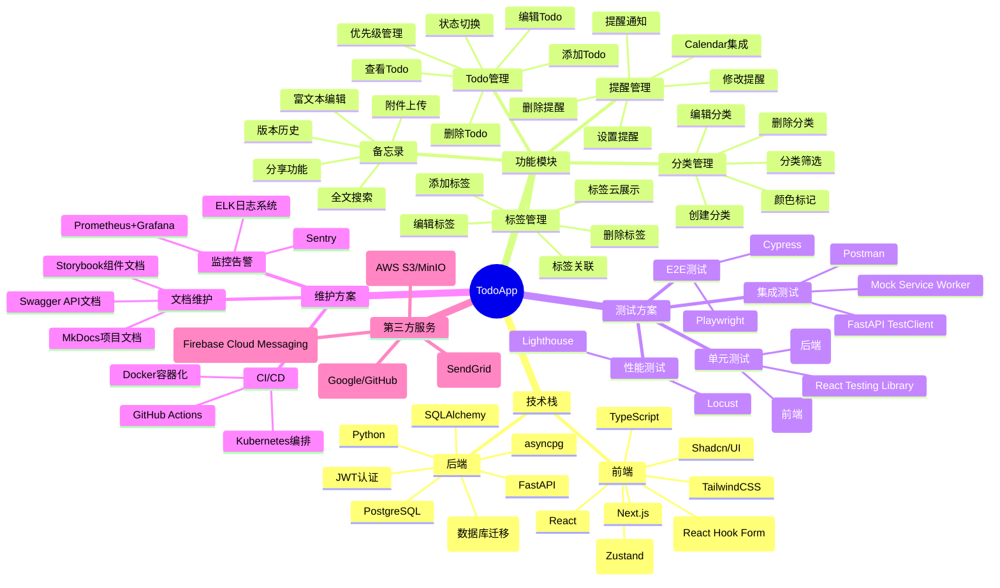
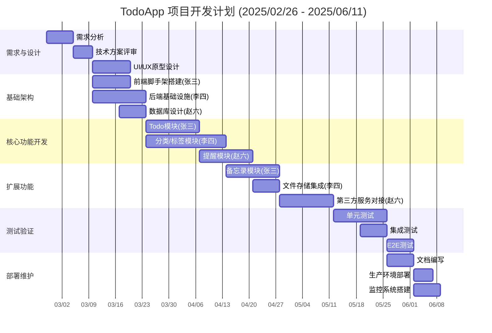

# TodoApp

## 项目介绍

本项目是一个基于React+Next.js+TailwindCSS+TypeScript+Shadcn/UI的TodoApp，后端使用Python+FastAPI。其主要功能是：

- 添加、编辑、删除、查看Todo
- 添加、编辑、删除、查看Todo分类
- 添加、编辑、删除、查看Todo标签
- 添加、编辑、删除、查看Todo提醒
- 添加、编辑、删除、查看Todo备忘录

## 小组成员及分工

| 姓名                                | 学号         | 分工                     |
| ----------------------------------- | ------------ | ------------------------ |
| [张三](https://github.com/zhangsan) | 202201010101 | 前端核心开发+扩展模块    |
| [李四](https://github.com/lisi)     | 202201010102 | 后端服务+基础设施        |
| [赵六](https://github.com/zhaoliu)  | 202201010103 | 数据库+提醒系统+服务集成 |

## 项目结构

## 项目计划

## 项目其他文档

- [UI/UX 设计](./design)
- [系统架构](./architecture)
- [API设计](./api)