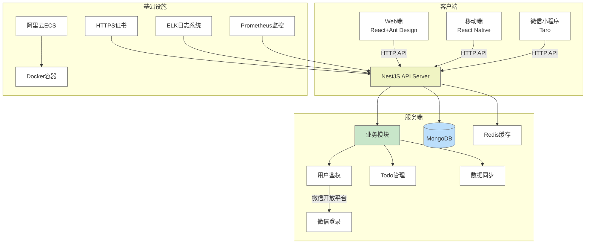
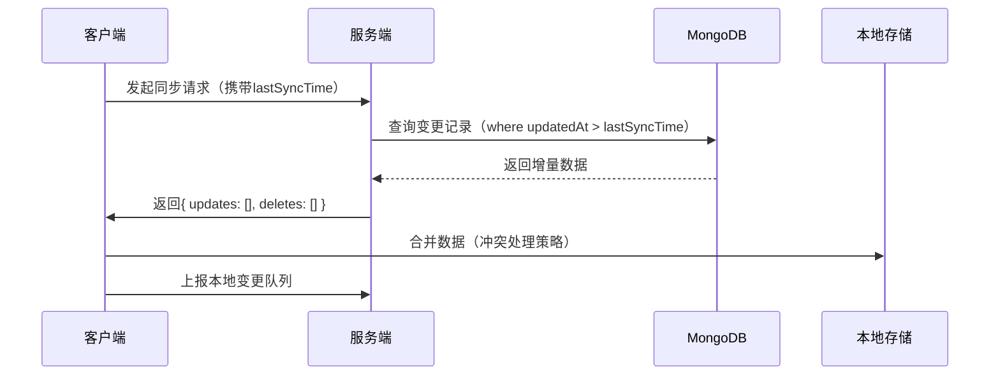
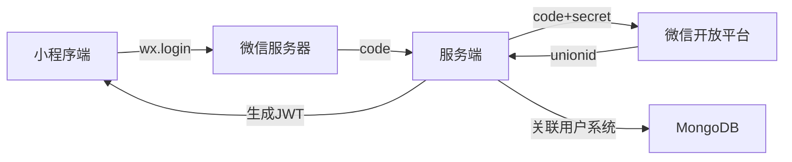

# 系统架构

## 技术栈选择依据：

1. **服务端**：
   - **NestJS**：TypeScript支持、模块化架构、集成Swagger文档
   - **MongoDB**：灵活存储Todo数据结构（支持标签/分类/时间戳）
   - **Redis**：缓存高频访问的Todo列表数据
   - **JWT**：结合微信UnionID实现跨端用户体系

2. **Web端**：
   - **React 18**：函数组件+Hooks开发模式
   - **Ant Design**：企业级UI组件库（Table/Form/Calendar）
   - **Zustand**：轻量级状态管理
   - **Vite**：快速构建工具

3. **移动端**：
   - **React Native**：复用Web业务逻辑（共享TypeScript类型定义）
   - **React Navigation**：实现底部Tab导航
   - **SQLite**：本地离线存储（同步冲突解决方案）

4. **微信小程序**：
   - **Taro 3**：React语法统一多端开发
   - **Taro UI**：适配小程序样式的组件库
   - **WXS**：优化性能关键路径

## 关键架构设计：

1. **数据同步方案**：

2. **微信登录流程**：

3. **性能优化措施**：
   - **CDN加速**：静态资源部署到OSS
   - **分页加载**：Todo列表无限滚动
   - **Web Worker**：复杂计算（如Todo统计分析）
   - **差分同步**：仅传输变更数据
